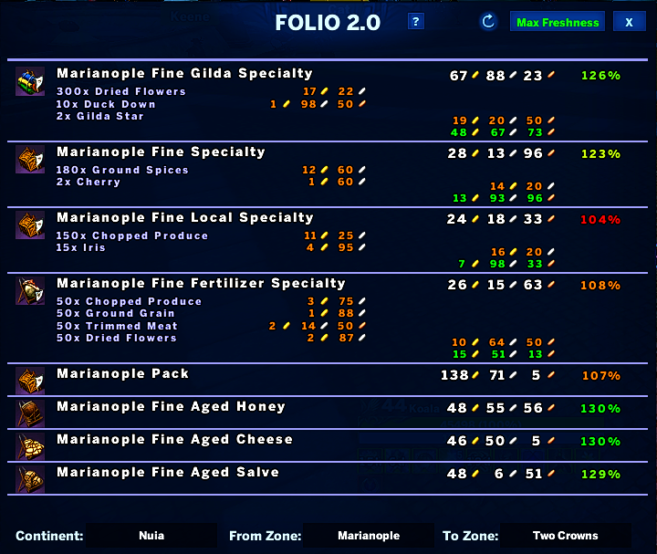

# Folio105

A trade pack helper that displays pack prices and resource information between zones. Pick a "from" continent/zone and a "to" zone to see what packs are worth running.

## Preview

## Features

- Source and destination zone selectors with combo boxes.
- Built-in price and resource tables for trade packs.
- Favorites panel docked to the right of the main window — save trade routes and reopen them in one click.
- Auto-fills the zone selectors and loads prices when a favorite is selected.
- Scrollable favorites list with per-row delete and a draggable scrollbar.
- Per-character persistence (saved via `ADDON:SaveData` / `LoadData`).
- Movable window with custom icons (copper / silver / gold).
- Remembers window position between sessions.

## Usage

Open the window from the toggle button, choose your source and destination zones, and review the listed pack values. Click the **Favorites** button to save the current route or jump straight to a saved one — the favorites panel follows the main window when dragged.
