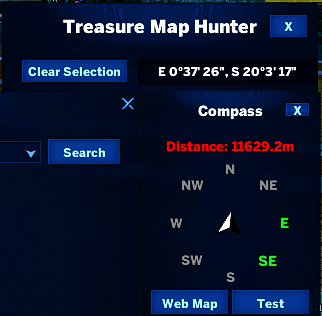

# TreasureMapHunter

Scans your inventory for treasure maps and shows them in a dedicated window with a compass to help you locate the dig spot.

## Preview

## Features

- Auto-detects treasure maps in your bag.
- Map preview window and on-screen compass widget.
- Refresh timer keeps the list in sync as maps are added or used.
- Saves window positions between sessions.

## Usage

Open the window from its toggle button. Select a map to display it; the compass will guide you toward the target location.
