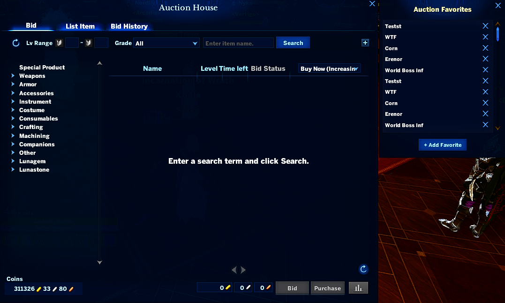

# AuctionFavs

A small ArcheRage addon that adds a saved-searches panel to the Auction House. Press your auction-house keybind and a favorites list opens alongside the AH window. Click any saved search to run it instantly.

## Features

- **Auto-opens with the auction house.** Press your "Enter Auction House" keybind (default `P`) and both the AH and the favorites panel open together. Press again to close both.
- **One-click search.** Click any saved favorite to run that search in the auction. Hover highlights the row green.
- **Scrollable list.** 10 visible rows at a time, with a scroll bar and mouse-wheel support.
- **Add / delete favorites.** "+ Add Favorite" opens a popup to type a new search term. Each row has a small `x` to delete.
- **Draggable, position remembered.** Drag the panel anywhere; the position is saved per-character and survives UI scale changes.
- **Two-way storage.** Favorites are saved both via the in-game save system and to a plain text file at `Documents/ArcheRage/Addon/AuctionFavs/favorites.txt` — edit it externally if you want.

## Usage

- **Open / close**: press your auction keybind. Opens the AH and the favorites panel together; pressing again closes both. The panel also closes automatically when you close the auction window via the X.
- **Search a favorite**: click the row. The auction will run that search.
- **Add a favorite**: click `+ Add Favorite`, type a search term, press `Save`.
- **Delete a favorite**: click the small `x` on the right of the row.
- **Reposition**: drag the panel anywhere. The position is saved.
- **Dismiss the panel only**: click the `x` in the panel's top-right, or press `ESC`. The AH stays open.

## How the hotkey works

The current usage of ADDON:GetContentMainScriptPosVis only work's with certain UIC_* that have a specific line of code added to their actual function in the game files, Until that has been fixed for UIC_AUCTION this is what I have had to do to make it work.

To work around this, AuctionFavs reads whatever key you have bound to `toggle_auction` ("Enter Auction House") and re-binds that key to its own custom action. When you press the key, the addon's handler fires `HOTKEY_ACTION`, then calls `ADDON:ToggleContent(UIC_AUCTION)` so the auction window still opens normally.

**Caveat**: if you disable the addon, the bound key will no longer open the auction window — re-bind "Enter Auction House" in the keybinds menu to restore it.
