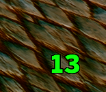

# bagslotcount

Displays the number of free slots in your bag at a glance. No more opening the inventory just to check capacity before a farm run.

## Preview

## Features

- Live free-slot counter in a movable window with commands.
- Updates as you loot, sell, or move items.
- Position remembered between sessions.

## Usage

Commands
!bags up/down/left/right number Example
!bags up 200 moves the bag number up 200 pixels.
